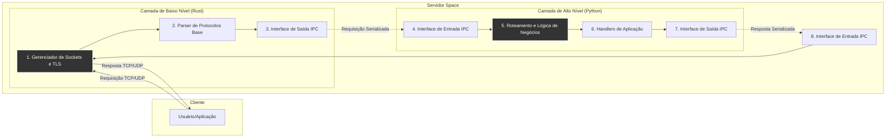

# Issue #002: Visão Geral da Arquitetura do Servidor Space

Este documento descreve a arquitetura de duas camadas do servidor Space, definindo as responsabilidades de cada componente e o mecanismo de comunicação entre eles.

## 1. Diagrama da Arquitetura

O diagrama abaixo ilustra o fluxo de uma requisição através das duas camadas principais do servidor.

## 2. Responsabilidades das Camadas

### Camada de Baixo Nível (escrita em Rust)

Esta camada é o "motor" do servidor. Sua principal responsabilidade é a performance e a eficiência no manejo de rede. Ela opera perto do sistema operacional para garantir alta concorrência e segurança de baixo nível.

- **Gerenciamento de Rede e Sockets:** Ouve as portas TCP/UDP, aceita, gerencia e encerra conexões de forma não bloqueante, usando multiplexação de I/O (como `epoll` ou `io_uring`).
- **Processamento de Protocolos Fundamentais:** Lida com o handshake TCP, o handshake TLS (`rustls`) e faz o parsing inicial de protocolos de rede (IP, TCP, UDP) e de aplicação (identificação de versão HTTP, framing de pacotes, etc).
- **Segurança de Baixo Nível:** Implementa proteções contra ataques a nível de rede (ex: SYN floods, buffer overflows) e gerencia a criptografia/decriptografia TLS.
- **Eficiência de Memória:** Gerencia buffers de rede de forma otimizada para minimizar alocações e cópias de dados.
- **Interface de Comunicação (IPC):** Atua como o "servidor" na comunicação inter-camadas, enviando dados pré-processados para a camada Python e aguardando respostas.

### Camada de Alto Nível (escrita em Python 3.11)

Esta camada é o "cérebro" do servidor. Ela lida com a lógica de negócios da aplicação, sendo mais flexível e rápida para desenvolver. A restrição ao uso de módulos nativos garante um ambiente controlado e seguro.

- **Lógica de Negócios:** Implementa as regras da aplicação, o que fazer com cada tipo de requisição.
- **Roteamento Inteligente:** Analisa as requisições (URLs, cabeçalhos) recebidas da camada Rust e as direciona para o handler apropriado (site estático, dinâmico, API, etc.).
- **Processamento de Conteúdo:** Serve arquivos estáticos, gera páginas dinâmicas, processa formulários e interage com bancos de dados (`sqlite3` nativo) ou outros serviços.
- **Gerenciamento de Sessão e Autenticação:** Lida com cookies, sessões e validação de credenciais (ex: JWT usando `hashlib` e `hmac`).
- **Interface de Comunicação (IPC):** Atua como o "cliente" na comunicação inter-camadas, recebendo requisições da camada Rust, processando-as e enviando as respostas de volta.

## 3. Comunicação Inter-Camadas (IPC - Inter-Process Communication)

A comunicação entre as camadas Rust e Python é um ponto crítico para a performance geral.

- **Mecanismo Proposto: Sockets de Domínio Unix (Unix Domain Sockets)**
  - **Justificativa:** Este mecanismo é extremamente eficiente para comunicação entre processos na mesma máquina. Ele opera através do sistema de arquivos, evitando todo o overhead da pilha de rede TCP/IP (cálculo de checksum, roteamento, etc.). É seguro (controlado por permissões de arquivo) e tem suporte assíncrono robusto tanto em Rust (`tokio`) quanto em Python (`asyncio`).

- **Protocolo de Serialização:**
  - Os dados trocados através do socket não serão texto puro. Para máxima eficiência, usaremos um formato de serialização binária.
  - **Proposta:** `Bincode` ou `FlatBuffers`.
  - **Funcionamento:** A camada Rust montará uma `struct` com os dados da requisição (ID da conexão, IP do cliente, cabeçalhos, corpo) e a serializará em bytes. A camada Python receberá esses bytes, desserializará para um objeto Python, processará a lógica e devolverá uma resposta serializada da mesma forma.

  
## Gerenciamento de Recursos e Resiliência

Esta seção documenta as estratégias usadas na camada de baixo nível para garantir o uso eficiente e seguro dos recursos do sistema.

### Gerenciamento de Memória
- **Buffers de Rede:** A manipulação de dados de I/O utiliza a crate `bytes` com a estrutura `BytesMut`. Esta abordagem previne alocações de memória excessivas e mitiga riscos de segurança como *buffer overflows*, pois o buffer gerencia seu próprio crescimento de forma segura.
- **Prevenção de Vazamentos:** A segurança de memória do Rust, baseada no sistema de posse (ownership) e tempo de vida (lifetimes), garante que a memória seja liberada assim que um recurso (como um socket ou um buffer) sai de escopo, prevenindo vazamentos de memória.

### Gerenciamento de CPU
- **Modelo Multi-Worker:** O servidor utiliza um worker por núcleo de CPU, com a opção de socket `SO_REUSEPORT`. Isso permite que o kernel distribua a carga de aceitação de novas conexões entre todos os núcleos, evitando que um único núcleo se torne um gargalo.
- **I/O Não Bloqueante:** Toda a operação de rede é assíncrona, baseada no *event loop* do Tokio. Isso garante que as threads dos workers nunca fiquem bloqueadas esperando por I/O, permanecendo livres para processar outras tarefas e maximizando o uso da CPU.

### Gerenciamento de Descritores de Arquivo
- **Timeouts e Keep-Alive:** O servidor implementa timeouts de inatividade no nível da aplicação e configura o TCP Keep-Alive no nível do SO. Ambos os mecanismos garantem que conexões "zumbis" ou inativas sejam encerradas, liberando seus respectivos descritores de arquivo e prevenindo o esgotamento deste recurso.
- **Graceful Shutdown:** Ao receber um sinal de interrupção (`Ctrl+C`), o servidor para de aceitar novas conexões, permite que as existentes terminem seu trabalho e encerra todos os recursos de forma limpa.