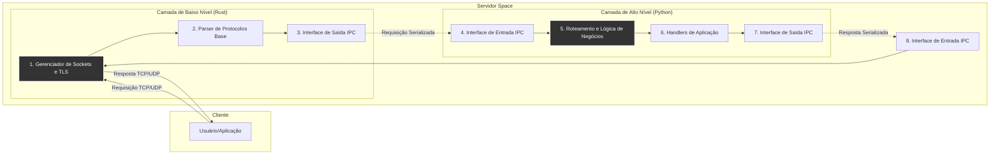

# Issue #002: Visão Geral da Arquitetura do Servidor Space

Este documento descreve a arquitetura de duas camadas do servidor Space, definindo as responsabilidades de cada componente e o mecanismo de comunicação entre eles.

## 1. Diagrama da Arquitetura

O diagrama abaixo ilustra o fluxo de uma requisição através das duas camadas principais do servidor.

## 2. Responsabilidades das Camadas

### Camada de Baixo Nível (escrita em Rust)

Esta camada é o "motor" do servidor. Sua principal responsabilidade é a performance e a eficiência no manejo de rede. Ela opera perto do sistema operacional para garantir alta concorrência e segurança de baixo nível.

- **Gerenciamento de Rede e Sockets:** Ouve as portas TCP/UDP, aceita, gerencia e encerra conexões de forma não bloqueante, usando multiplexação de I/O (como `epoll` ou `io_uring`).
- **Processamento de Protocolos Fundamentais:** Lida com o handshake TCP, o handshake TLS (`rustls`) e faz o parsing inicial de protocolos de rede (IP, TCP, UDP) e de aplicação (identificação de versão HTTP, framing de pacotes, etc).
- **Segurança de Baixo Nível:** Implementa proteções contra ataques a nível de rede (ex: SYN floods, buffer overflows) e gerencia a criptografia/decriptografia TLS.
- **Eficiência de Memória:** Gerencia buffers de rede de forma otimizada para minimizar alocações e cópias de dados.
- **Interface de Comunicação (IPC):** Atua como o "servidor" na comunicação inter-camadas, enviando dados pré-processados para a camada Python e aguardando respostas.

### Camada de Alto Nível (escrita em Python 3.11)

Esta camada é o "cérebro" do servidor. Ela lida com a lógica de negócios da aplicação, sendo mais flexível e rápida para desenvolver. A restrição ao uso de módulos nativos garante um ambiente controlado e seguro.

- **Lógica de Negócios:** Implementa as regras da aplicação, o que fazer com cada tipo de requisição.
- **Roteamento Inteligente:** Analisa as requisições (URLs, cabeçalhos) recebidas da camada Rust e as direciona para o handler apropriado (site estático, dinâmico, API, etc.).
- **Processamento de Conteúdo:** Serve arquivos estáticos, gera páginas dinâmicas, processa formulários e interage com bancos de dados (`sqlite3` nativo) ou outros serviços.
- **Gerenciamento de Sessão e Autenticação:** Lida com cookies, sessões e validação de credenciais (ex: JWT usando `hashlib` e `hmac`).
- **Interface de Comunicação (IPC):** Atua como o "cliente" na comunicação inter-camadas, recebendo requisições da camada Rust, processando-as e enviando as respostas de volta.

## 3. Comunicação Inter-Camadas (IPC - Inter-Process Communication)

A comunicação entre as camadas Rust e Python é um ponto crítico para a performance geral.

- **Mecanismo Proposto: Sockets de Domínio Unix (Unix Domain Sockets)**
  - **Justificativa:** Este mecanismo é extremamente eficiente para comunicação entre processos na mesma máquina. Ele opera através do sistema de arquivos, evitando todo o overhead da pilha de rede TCP/IP (cálculo de checksum, roteamento, etc.). É seguro (controlado por permissões de arquivo) e tem suporte assíncrono robusto tanto em Rust (`tokio`) quanto em Python (`asyncio`).

- **Protocolo de Serialização:**
  - Os dados trocados através do socket não serão texto puro. Para máxima eficiência, usaremos um formato de serialização binária.
  - **Proposta:** `Bincode` ou `FlatBuffers`.
  - **Funcionamento:** A camada Rust montará uma `struct` com os dados da requisição (ID da conexão, IP do cliente, cabeçalhos, corpo) e a serializará em bytes. A camada Python receberá esses bytes, desserializará para um objeto Python, processará a lógica e devolverá uma resposta serializada da mesma forma.

  
## Gerenciamento de Recursos e Resiliência

Esta seção documenta as estratégias usadas na camada de baixo nível para garantir o uso eficiente e seguro dos recursos do sistema.

### Gerenciamento de Memória
- **Buffers de Rede:** A manipulação de dados de I/O utiliza a crate `bytes` com a estrutura `BytesMut`. Esta abordagem previne alocações de memória excessivas e mitiga riscos de segurança como *buffer overflows*, pois o buffer gerencia seu próprio crescimento de forma segura.
- **Prevenção de Vazamentos:** A segurança de memória do Rust, baseada no sistema de posse (ownership) e tempo de vida (lifetimes), garante que a memória seja liberada assim que um recurso (como um socket ou um buffer) sai de escopo, prevenindo vazamentos de memória.

### Gerenciamento de CPU
- **Modelo Multi-Worker:** O servidor utiliza um worker por núcleo de CPU, com a opção de socket `SO_REUSEPORT`. Isso permite que o kernel distribua a carga de aceitação de novas conexões entre todos os núcleos, evitando que um único núcleo se torne um gargalo.
- **I/O Não Bloqueante:** Toda a operação de rede é assíncrona, baseada no *event loop* do Tokio. Isso garante que as threads dos workers nunca fiquem bloqueadas esperando por I/O, permanecendo livres para processar outras tarefas e maximizando o uso da CPU.

### Gerenciamento de Descritores de Arquivo
- **Timeouts e Keep-Alive:** O servidor implementa timeouts de inatividade no nível da aplicação e configura o TCP Keep-Alive no nível do SO. Ambos os mecanismos garantem que conexões "zumbis" ou inativas sejam encerradas, liberando seus respectivos descritores de arquivo e prevenindo o esgotamento deste recurso.
- **Graceful Shutdown:** Ao receber um sinal de interrupção (`Ctrl+C`), o servidor para de aceitar novas conexões, permite que as existentes terminem seu trabalho e encerra todos os recursos de forma limpa.

## Camada de Alto Nível (Python): Restrição de Dependências

Uma das diretrizes de arquitetura mais importantes para a camada de alto nível em Python é a **restrição ao uso exclusivo de módulos da Biblioteca Padrão do Python em ambientes de produção**.

### A Regra

Para o ambiente de produção, a camada de alto nível em Python deve utilizar **exclusivamente** os módulos que fazem parte da Biblioteca Padrão do Python 3.11. Nenhuma dependência externa (instalada via `pip` do PyPI, como `requests`, `FastAPI`, `pandas`, etc.) é permitida no deploy de produção.

### Justificativa

Esta decisão radical é baseada em quatro pilares fundamentais:

1.  **Segurança Máxima:** Reduz a superfície de ataque a zero no que tange a dependências. Elimina completamente o risco de *supply chain attacks*, onde pacotes de terceiros podem ser comprometidos.
2.  **Confiabilidade e Estabilidade:** Evita a instabilidade introduzida por bugs, *breaking changes*, ou o abandono de bibliotecas de terceiros. A Biblioteca Padrão é robusta, estável e mantida junto com a linguagem.
3.  **Performance Controlada:** Garante que não haja sobrecarga de performance (overhead) de bibliotecas externas potencialmente mal otimizadas ou "inchadas". O controle sobre todo o código executado é total.
4.  **Simplicidade de Deploy:** O ambiente de produção se torna minimalista. Não há necessidade de gerenciar `requirements.txt` ou executar `pip install`. O container ou servidor de produção precisa apenas do runtime do Python 3.11, nada mais.

### Implicações Práticas

-   **Deserialização:** Como não podemos usar pacotes como `py-bincode`, a desserialização das mensagens enviadas pelo Rust será implementada em Python puro, lendo os bytes de acordo com a especificação do formato `bincode`.
-   **Frameworks Web:** Não utilizaremos frameworks como `FastAPI` ou `Flask`. A lógica de manipulação de requisições será construída sobre os módulos nativos `asyncio` e, possivelmente, `http.server`, ou através do parse manual dos bytes da requisição HTTP.
-   **Outras Funcionalidades:** Qualquer funcionalidade (ex: acesso a banco de dados) deve ser implementada usando os módulos nativos correspondentes (`sqlite3`, `socket`, etc.) ou através da comunicação com outros microsserviços.

### Exceções

Ferramentas de **desenvolvimento**, como `pytest` para testes, `black` para formatação de código, e `ruff` para linting, são permitidas e incentivadas no ambiente de desenvolvimento, mas **não devem** fazer parte do build de produção.

### Tratamento de Protocolos Avançados (HTTP/2, HTTP/3)

A estratégia para lidar com diferentes versões do protocolo HTTP é dividida entre as camadas:

-   **HTTP/1.x:** Este protocolo é baseado em texto e relativamente simples. Toda a lógica de parsing (análise de request-line, cabeçalhos e corpo) é de responsabilidade da **camada de alto nível (Python)**, que oferece flexibilidade para isso. A camada Rust atua como um simples proxy, encaminhando os bytes da conexão TLS.

-   **HTTP/2 e HTTP/3 (QUIC):** Estes são protocolos binários, multiplexados e muito mais complexos. Lidar com o "framing", streams e controle de fluxo em Python puro seria ineficiente e complexo. Portanto, a responsabilidade de lidar com a complexidade destes protocolos será da **camada de baixo nível (Rust)**. O núcleo Rust irá decodificar os frames de H2/H3 e enviará mensagens simplificadas e estruturadas (similares a uma requisição HTTP simples) para a camada Python via IPC. A camada Python permanecerá focada na lógica de negócios, independente da complexidade do protocolo de transporte.

## Interface de Gateway de Aplicação (SGI)

Para permitir a extensibilidade, o Servidor Space define uma interface de gateway interna, inspirada no ASGI. Qualquer aplicação ou adaptador compatível deve ser um objeto "chamável" (callable) que segue a seguinte especificação assíncrona:

`async def application(scope: dict, receive: callable, send: callable) -> None:`

Onde:
-   **`scope` (dict):** Um dicionário contendo informações da requisição, como:
    -   `type` (str): O tipo de evento (ex: 'http').
    -   `method` (str): O método HTTP (ex: 'GET').
    -   `path` (str): O caminho da URL.
    -   `headers` (dict): Um dicionário com os cabeçalhos da requisição.
-   **`receive` (awaitable):** Uma função assíncrona que, quando aguardada (`await receive()`), retorna o corpo da requisição em bytes.
-   **`send` (awaitable):** Uma função assíncrona que a aplicação usa para enviar a resposta de volta para o servidor em partes (ex: `await send({'type': 'http.response.start', 'status': 200, ...})`, `await send({'type': 'http.response.body', 'body': b'...' })`).

Esta interface é a base para a integração com frameworks customizados e para os adaptadores WSGI/ASGI.